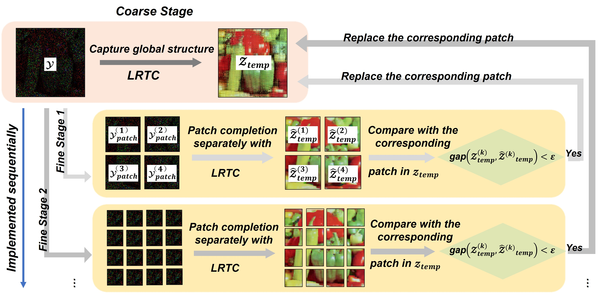
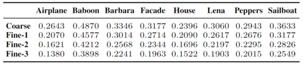

# Coarse to Fine: Image Restoration Boosted by Multi-Scale Low-Rank Tensor Completion Strategy (Link)


## C2F-LRTC


## Advantage
+ A general and intuitive coarse-to-fine strategy that stimulates the potential power of existing LRTC methods for color image restoration tasks is proposed, in which the image of poor quality is restored by taking a proper balance between the potentially low- and high-rank parts.

+ By exploring the data from both coarse and fine viewpoint, the proposed C2F strategy allows LRTC methods to capture both the global and local structure of the data.

+ Extensive experiments exemplify that the proposed C2F can improve the performance of the existing LRTC methods. In addition, the ablation study demonstrates the necessity and rationality of C2F.

## Running Codes
Our experiments were all done on an Intel(R) Core(TM) i5-
6500 processor running at 3.2GHz with 16 GB RAM, and
the implementation platform is MATLAB 2020b.

### Installaltion
Download the C2F codes by running:
 ```
 git clone https://github.com/RuiLin0212/C2FLRTC.git
 ```

### Reproducing the Performance of C2F-LRTC Methods in Our Paper
After downloading the codes, and switching to the path with all the subfolders added, one can reproduce our results reported for the four C2F-LRTC methods by running the following files:
```
test_performance_STDC.m
test_performance_LRTC_TV_II.m
test_performance_SPC.m
test_performance_LRTV_PDS.m
```

Once finished, restored images and evaluation metrics for the whole image and every small patch in both coarse and fine stages will be stored in ```.mat``` files.

### Plugging in Other LRTC Methods and Completing New Images

If you want to try other LRTC methods with our proposed C2F scheme, please add the selected LRTC methods under the ```./C2FLRTC ``` path. Then you are supposed to modifying the following four codes blocks (taking ```test_performance_LRTV_TV_II.m``` as the basis for modification):

Firstly, you should initialize the propoer hyper-parameters for your selected LRTC method by modifiying the block below:
```
% initialize hyper-parameters for LRTC_TV_II (line 57 - 64)

N=3;
lambda=0.02;
alpha=[1/N, 1/N, 1/N];
beta=[1,1,0];  % which decides using LRTC-TV-II ([1,1,0]) or STDC ([0,0,0])

fprintf('-------------- LRTC_TV_II -------------------\n');
lambda_1=0.5;
lambda_2=1000;
```

Next, you are supposed to replace the LRTC_TV_II with the selected LRTC method for the coarse stage completion by modifying:
```
% coarse stage completion (line 87)

Z_TRLRTV2_temp=LRTC_TV_II(index_temp,value_temp, lambda_1, lambda_2 ,alpha, beta, size(B_pad), N ,300);
```

The third step is to modify how the hyper-parameters change during the sequencial fine stages, you are expected to modify the following block or you can delete this part if you wish the hyper-parameters stay the same during the whole completion process:
```
# hyper-parameters update (line 130 - 143)

if i<6
    lambda_1_temp=lambda_1;
    lambda_2_temp=lambda_2;
    alpha=[1/N, 1/N, 1/N]*(i);
else 
    lambda_1_temp=lambda_1/((2^3));
    lambda_2_temp=lambda_2/((2^(3))^2);
    
    B_temp_large=imresize(B_temp,[floor(size(B_temp,1)*2^(i-3)),floor(size(B_temp,2)*2^(i-3))],'box');
    
    [index_temp_large]=find(B_temp_large(:));
    value_temp_large=B_temp_large(index_temp_large);
    patch_size_temp=size(B_temp_large);
end
```

The final step is to replace the LRTC-TV-II methods with the choosen LRTC method in the fine stages, this can be achieved by rewriting the codes below:
```
% Fine stage completion (line 145 - 153)

if i<6
    %%%%%%%%%% LRTC completion %%%%%%%%%%
    Z_TRLRTV2_patch=LRTC_TV_II(index_temp,value_temp, lambda_1_temp, lambda_2_temp ,alpha, beta, patch_size, N ,100);
else
    %%%%%%%%%% LRTC completion %%%%%%%%%%
    Z_TRLRTV2_patch=LRTC_TV_II(index_temp_large,value_temp_large, lambda_1_temp, lambda_2_temp ,alpha, beta, patch_size_temp, N ,100);
    
    Z_TRLRTV2_patch=imresize(Z_TRLRTV2_patch,[size(B_temp,1),size(B_temp,2)]);
end
```


## Experimental Results

### Pure LRTC vs. C2F-LRTC

### The Effectiveness of Gradual Refinement

### Local Rank Analysis
The relative patch rank for patches of different sizes. In each column, the average relative patch rank decreases as the patch size becomes smaller, which is consistent with our experimental settings. 

The relative patch rank is defined as the ratio between the number of singular values, the addition of which accounts for 90% of the total singular values summation, and the patch size. The patch size can be ignored along this side while comparing the patch rank.

 

## License
C2F is released under MIT License.


